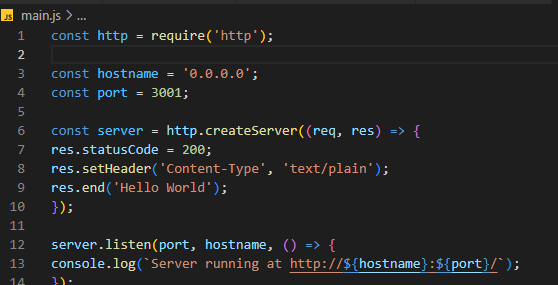

# Membuat Node.js app

## Install Docker

### Pada tahap ini, Docker meminta saya untuk update wsl

### Ini bukti bahwa docker telah terinstal

### Download source code Node.js dan menyimpannya dengan nama main.js

### Membuat image menggunakan Dockerfile tanpa instalasi Node.js

### Menjalakan Container dengan melakukan setting pada bagian port yang akan dapat mengakses port source code(-p), di sini saya memilih port 8081 untuk bisa mengakses port source code di 3001. Lalu memberi perintah untuk menjalankan Container di bagian belakang dan tampilkan ID Container tsb (-d)

### Melakukan cek apakah Container tersebut sudah berhasil dijalankan(ps)

### Saya mencoba akses sesuai port yang sudah disetting sebelumnya

## 1. Membuat Direktori Baru
### Tempat semua file akan disimpan. Di direktori ini buat file package.json yang mendeskripsikan aplikasi  dan dependensinya:

### Dengan file package.json baru, jalankan npm install. Jika menggunakan npm versi 5 atau lebih baru, ini akan menghasilkan file package-lock.json yang akan disalin ke image Docker Anda.

## 2. Buat file main.js

### Ini menunjukan bahwa aplikasi web dibangun menggunakan bahasa JavaScript

## 3. Membuat Dockerfile 

### Buat file kosong bernama Dockerfile di teks editor yang anda suka, di sini saya menggunakan VSCode

### Hal pertama yang perlu kita lakukan adalah menentukan dari images apa kita ingin membuilding. Di sini saya menggunakan versi terbaru LTS (long term support) 20-alpine3.17 dari node yang tersedia di Docker Hub

### Selanjutnya kita membuat direktori untuk menyimpan kode aplikasi di dalam images, ini akan menjadi direktori eksekusi untuk aplikasi saya

### Images ini dilengkapi Node.js dan NPM yang sudah diinstal sehingga hal selanjutnya adalah menginstal dependensi aplikasi menggunakan npm. Harap perhatikan bahwa jika Anda menggunakan npmversi 4 atau sebelumnya, package-lock.json file tidak akan dibuat.

### Daripada menyalin seluruh direktori, saya hanya menyalin file package.json. Ini memungkinkan saya memanfaatkan chaced layer Docker. Selain itu, npm membantu menyediakan proses build yang lebih  faster, reliable, reproducible untuk lingkungan produksi kedepannya

### Membundle source code aplikasi ke dalam Image Docker dengan perintah COPY

### Menentukan port sesuai info yang didapat dari source code tugas dengan menggunakan perintah EXPOSE, hal ini bermaksud untuk pemetaan yang dilakukan docker daemon

### Untuk perintah menjalankan aplikasi gunakan CMD yang akan menentukan runtime aplikasi. Di sini saya akan menggunakan node main.js untuk memulainya

### Tampilan keselurah dari bentuk Dockerfile yang saya buat

